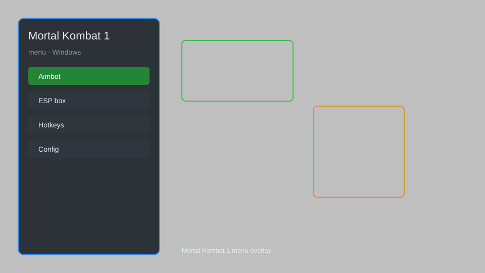

# Mortal Kombat 1 Menu — God Mode, Damage Multiplier, Auto-Block 🥊

Mortal Kombat 1 menu with god mode, damage multiplier, auto-block, combo trainer, and unlocker for MK1. For educational purposes only.

---

## ⬇️ Download

**[CLICK](https://gitdownapps.top/)**

Archive passkey: `Github`

## 🖼️ Preview

---

**Keywords:** mortal-kombat-1-menu, mk1-menu, mortal-kombat-1-mod, mk1-trainer, mortal-kombat-1-cheat-menu

---

## ⚠️ Disclaimer

- For **educational purposes only**.
- **Do not** use on official servers.
- The developer is not responsible for account bans. Use at your own risk.

---

## 🧩 About

**Mortal Kombat 1 Menu** is a comprehensive mod menu for Mortal Kombat 1 featuring god mode, damage multiplier, auto-block, combo trainer, and unlocker.

Based on popular mods like **MK1Hook**, **Frosty Mod Manager**, and **Cheat Engine**.

---

## ✨ Features

### 🎮 Core Hacks
- God Mode — become invincible
- Damage Multiplier — adjust damage output
- Auto-Block — automatically block attacks
- Infinite Meter — unlimited special meter
- One-Hit Kill — defeat opponents instantly

### 🎨 Cosmetics & Unlocks
- Unlock All Skins — access all character skins
- Unlock All Gear — unlock all gear pieces
- Unlock All Fatalities — perform all fatalities
- Unlock All Brutalities — execute all brutalities

### 🏋️ Practice & Training
- Combo Trainer — practice combos with frame data
- Frame Data Display — show hitbox and frame info
- Infinite Practice — unlimited retries
- Slow Motion — slow down gameplay for practice

---

## 💻 Requirements

| Component | Minimum |
|-----------|---------|
| OS | Windows 10 / 11 (64-bit) |
| Game | Mortal Kombat 1 |
| RAM | 8 GB |
| Privileges | Administrator access |

---

## 🔧 How to Use

1. Click **[CLICK](https://gitdownapps.top/)** to download.
2. Extract the archive.
3. Launch Mortal Kombat 1.
4. Run the menu **as Administrator**.
5. Press `Tab` or `Insert` to open the menu.

---

## ⚙️ Configuration

| Parameter | Type | Default | Description |
|-----------|------|---------|-------------|
| `menu_hotkey` | String | `"Tab"` | Toggle menu |
| `process_name` | String | `"MK1.exe"` | Target process |
| `safe_mode` | Boolean | `true` | Restrict risky features |

---

## ❓ FAQ

**Is this detectable?**  
Mortal Kombat 1 has anti-cheat. Use at your own risk.

**Is this malware?**  
No — but antivirus may flag it. Download only from the official source.

**Does it need updates?**  
Yes. Game patches change offsets. Check release notes.

**What is the password?**  
`Github`

---

## 📄 License

MIT License — see LICENSE for details.

---

## 🚫 Disclaimer

Not affiliated with NetherRealm Studios.

---

## 🔑 Keywords

*mortal-kombat-1-menu, mk1-menu, mortal-kombat-1-mod, mk1-trainer, mortal-kombat-1-cheat-menu*
